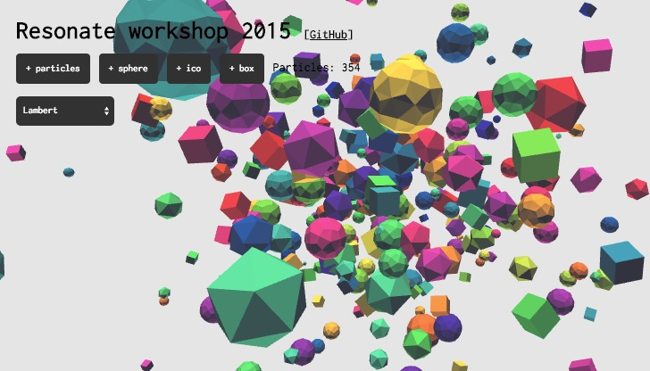

# resonate-workshop-2015



[](https://gitter.im/learn-postspectacular/resonate-workshop-2015?utm_source=badge&utm_medium=badge&utm_campaign=pr-badge&utm_content=badge) | [interactive version @ demo.thi.ng](http://demo.thi.ng/geom/resonate-2015/index.html)

April 13-15, 2015 Belgrade

## Preparations / requirements

To make the most of our time next week and since online connectivity at the workshop venue has been traditionally sporadic, please ensure you have the following requirements met before the workshop begins on Monday:

- [Java JDK 7 or 8](http://www.oracle.com/technetwork/java/javase/downloads/index.html)
- [Leiningen](http://leiningen.org)
- [Counterclockwise (CCW)](http://doc.ccw-ide.org/documentation.html#install-as-standalone-product)

The last tool (CCW) is an Eclipse based Clojure IDE, which is x-platform, easy to install and we already used successfully in [last year's workshop](https://github.com/learn-postspectacular/resonate-workshop-2014). However, this just a recommendation and you're of course free to use any other editor.

Please also already clone this repo and execute the following to force downloading most (if not all) other necessary library dependencies:

```
cd resonate-workshop-2015
lein deps
```

## Daily reports

### Day 1

### Day 2

### Day 3


## Libraries

TBA

## Reading list & references

### Clojure & ClojureScript introduction

- [Clojure](http://clojure.org)
- [ClojureScript](https://github.com/clojure/clojurescript) ([quickstart](), [wiki]())
- [Leiningen sample project (full options)](https://github.com/technomancy/leiningen/blob/master/sample.project.clj)

#### Tutorials

- [Tutorial @ CAN](http://www.creativeapplications.net/tutorials/introduction-to-clojure-part-1/)
- [Brave Clojure](http://www.braveclojure.com/)
- [Clojure from the ground up](https://aphyr.com/posts/301-clojure-from-the-ground-up-welcome)

### Entity Component Systems

- [Understanding ECS](http://www.gamedev.net/page/resources/_/technical/game-programming/understanding-component-entity-systems-r3013)
- [T-Machine ECS blog series](http://t-machine.org/index.php/2007/09/03/entity-systems-are-the-future-of-mmog-development-part-1/)
- [Chris Granger's Chromashift](http://www.chris-granger.com/2012/12/11/anatomy-of-a-knockout/)

### Reactive programming

- [core.async](https://github.com/clojure/core.async) ([docs](http://clojure.github.io/core.async/), [walkthrough](https://github.com/clojure/core.async/blob/master/examples/walkthrough.clj))
- [React.js](http://facebook.github.io/react/)
- [Reagent](http://reagent-project.github.io)
- [Re-frame](https://github.com/Day8/re-frame/)

### Data, data, data (derived views, compute graphs etc.)

- [Turning the DB inside out](https://www.youtube.com/watch?v=fU9hR3kiOK0)
- [Signal/Collect](http://signalcollect.org)


## Get in touch

If you run into any problems, please get in touch via the above [gitter.im room](https://gitter.im/learn-postspectacular/resonate-workshop-2015), which we will use as backchannel.
